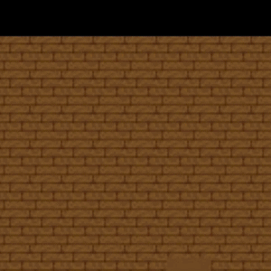

# Zombie Slayer - [Game](https://jmarkowitz098.github.io/action-rpg/dist/)


Zombie Slayer is a quick game where you have to defend yourself from incoming zombies. Slay as many as you can to get the high score!

## Technologies
1. JavaScript
2. HTML
3. CSS
4. Mocha.js

## Features
**Hero**
+ Move and attack with animated sprite
+ Ability to dash with invincibility frames
+ Health bar
+ Ability to use weapon with accurate hitbox

**Enemies**
+ Animated sprites
+ Random movement
+ Health system so enemies survive first hit

**Game Play**
+ Score increases as you slay enemies
+ Enemies endlessly spawn
+ Gameplay continues until hero runs out of health

## Challenges

**Getting movement to feel smooth**



One challenge for me was accounting for all the different ways someone can input movement. They can hold down, hold right, and then let go of right. In this instance, they would want to keep moving and facing down while moving right. Essentially, I had to make sure that movement and direction reflected the most recent button presses while also accounting for already held down buttons.

I solved this with a variety of `keydown`/`keyup` event listeners, as well as some filtering in the `hero_movement` class.

1. When a key is pressed if it is a movement key, that direction is added to a `keysDown` object with a value of `true`. 
2. At that time, the hero's `vel` is increased to 1 and his `dir` is changed based on which keys are currently down, using the `changeVel` and `changeDir` functions
3. `changeDir` calls `filterExtraKeys` to remove any directions that are set to `false`, as well as account for when a player has pushed conflicting direction keys (holding left than pressing right)
4. When a key is released, the `keysDown` object is updated to set that direction to false. Then, if there are still keys down, the hero's `dir` is changed to reflect only the keys that are still being pressed
5. When all keys have been released, the hero's `vel` is set back to zero so they stop moving

```javascript
onKeyUp(e){
    const { gameCanvas, dirOptions } = this

    if (dirOptions.hasOwnProperty(e.key)) {
        let dir = dirOptions[e.key]
        this.keysDown[dir] = false

        if(this.getMoveKeysDown().length > 0) 
            gameCanvas.hero.changeDir(this.keysDown)
    }

    if (Object.values(this.keysDown).every(val => val === false)) // Change with getMoveKeysDown()
        gameCanvas.hero.changeVel(0)
}

onKeyDown(e) {
    const { gameCanvas, dirOptions, keysDown } = this;

    if (dirOptions.hasOwnProperty(e.key)){
        keysDown[dirOptions[e.key]] = true;
        gameCanvas.hero.changeVel(C.HERO_NORMAL_VEL)
        gameCanvas.hero.changeDir(keysDown)
    }
}

// Reverse hero's direction when receivng opposing directions
filterExtraKeys(newDir, dir) {
    let filtered = newDir.filter(([key, val]) => val)
    if (filtered.length === 1) return filtered

    if (filtered[0][0] === C.DIR_RIGHT && filtered[1][0] === C.DIR_LEFT
        || filtered[0][0] === C.DIR_DOWN && filtered[1][0] === C.DIR_UP) 
            filtered = filtered[0][0] === dir ? [filtered[1]] : [filtered[0]]

            return filtered
}
```


## Future features
+ Add a variety of animations (hero takes damage, enemy takes damage, health sprite, weapon attack)
+ Menu screen
+ Sound effects and music
